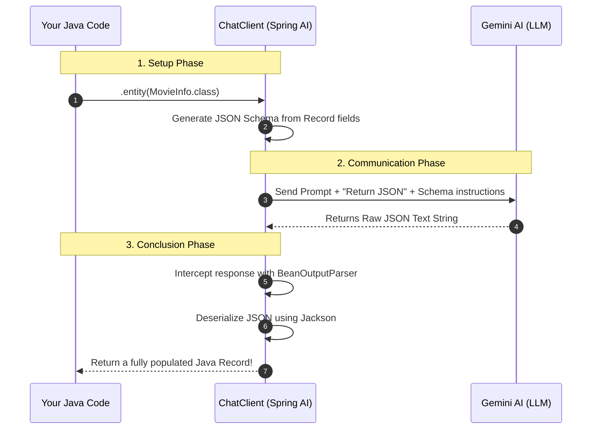
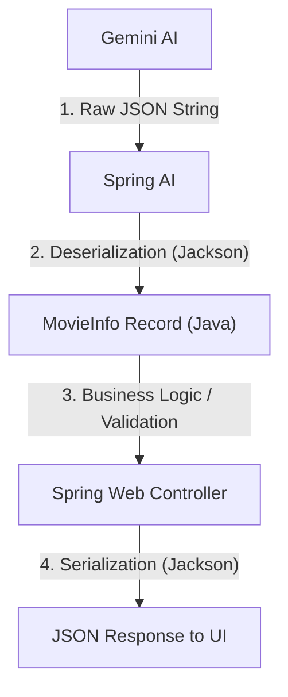

# Scenario 103: Structured AI Outputs (The DTO Pattern)

## 🎯 Goal
One of the most important concepts in production-level AI development is getting the AI to return data in a machine-readable format like JSON, rather than just unstructured text. This allows your application to reuse that data for database logic, UI components, or further processing.

## 🛠️ Implementation Details
In this scenario, we use the `chatClient.entity()` method which internally uses a `BeanOutputParser`.

### Key Code Snippet
```java
return chatClient.prompt()
        .user("Give me details about {movieName}")
        .call()
        .entity(MovieInfo.class);
```

Behind the scenes, Spring AI:
1.  Appends specific instructions to the prompt to return JSON.
2.  Defines the JSON schema based on the `MovieInfo` record.
3.  Parses the AI's JSON response back into a Java record.

## 🧠 Behind the Scenes: How `ChatClient` Works

When you use `.entity(MovieInfo.class)`, Spring AI performs a sophisticated "Handshake" between your Java code and the Large Language Model (LLM).

### 🎬 The Flow of Information



### 🛠️ Key Components
1.  **`ChatClient`**: The high-level fluent API that manages the orchestration.
2.  **`BeanOutputParser`**: The bridge that converts AI text into Java Beans/Records.
3.  **JSON Schema**: The "contract" sent to the AI to ensure it speaks our language.

---

## 🍽️ Real-World Analogy: The Professional Waiter

Think of your application as a **Restaurant**:

*   **The Developer (You)** is the **Customer**. You want a specific 4-course meal (Structured Data).
*   **The LLM (Gemini)** is the **Genius Chef**. They are brilliant but chaotic; if you just ask for "food," they might give you anything from a steak to a bowl of cereal.
*   **The `ChatClient`** is the **Professional Waiter**.

When you use `.entity(MovieInfo.class)`, the Waiter doesn't just tell the Chef "make a movie summary." Instead, the Waiter says:
> "Chef, prepare an 'Inception' summary, but it **MUST** be served on this 4-compartment tray (JSON Schema). I need the Title in slot 1, Year in slot 2, Genre in slot 3, and Summary in slot 4. **No garnishes, no talking—just the tray.**"

When the Chef finishing, the Waiter checks the tray, ensures everything is in the right slot, and brings you a perfectly organized meal (Java Record).

---

## 🔄 The Two-Step Serialization Process

You might wonder why we convert JSON to a Java Record, only to send it back as JSON to the UI. This is a critical pattern for robust applications:



### Why do we do this?
1.  **Validation**: It ensures the AI actually gave us a valid `MovieInfo` object. If the format is wrong, we catch it in the middle tier.
2.  **Safety**: We strip away any "AI chatter" or extra text that doesn't belong in our API.
3.  **Consistency**: Our UI always gets a predictable schema, even if the underlying AI model starts returning data in a slightly different format.

---

## 🧪 How to Test
Run the following `curl` command to get a structured JSON response:

```bash
curl "http://localhost:8081/spring-ai/api/scenario103/movie?name=The%20Matrix"
```

### Expected Output
```json
{
  "title": "The Matrix",
  "year": 1999,
  "genre": "Sci-Fi",
  "summary": "A computer hacker learns from mysterious rebels about the true nature of his reality..."
}
```

## 💡 Production Tip
**Schema Enforcement** is why we use `ChatClient`. It handles the "hallucination risk" where an AI might return text instead of JSON. If the AI output isn't valid JSON, Spring AI handles the error for you.
