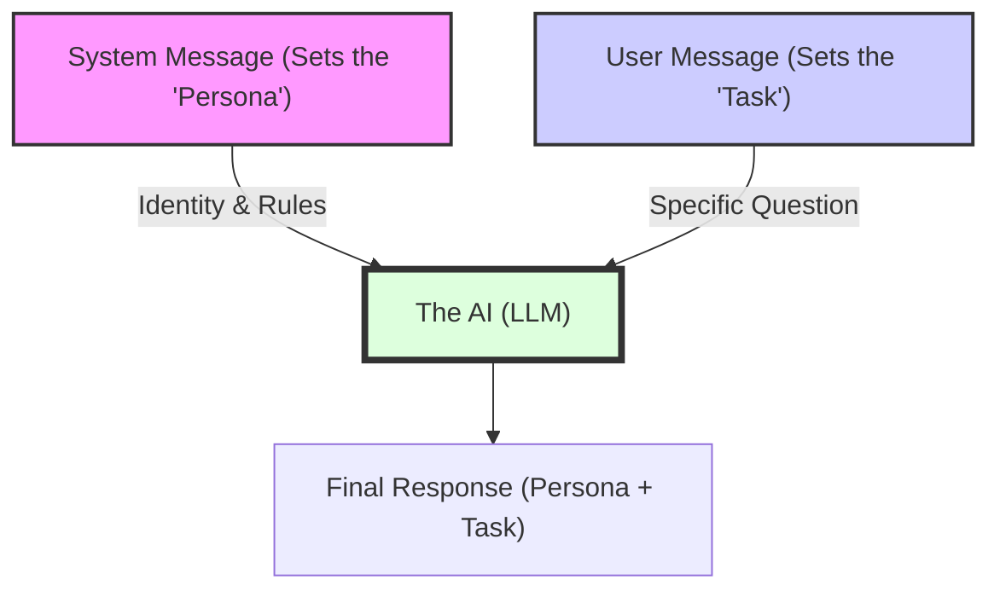

# Scenario 104: Prompt Templates & Roles

## 🎯 Goal
In real-world applications, prompt engineering becomes complex. Hardcoding long strings in your Java files makes them hard to read, version control, and maintain. 

This scenario teaches you how to:
1.  **Externalize Prompts**: Move prompts to `.st` (StringTemplate) files in your resources.
2.  **Define Personas (System Roles)**: Use "System Messages" to control the behavior and personality of the AI.

## 🧠 System vs. User Message Deep Dive: The "Method Actor"

To understand why we need both message types, it helps to think of the LLM as a **professional actor** waiting for your directions.

### 🎭 The Real-World Analogy: The Movie Set

*   **System Message (The Character Study)**: 
    Think of this as the actor’s role. You tell them: *"You are a Sherlock Holmes. You are highly logical, socially awkward, and use pure deduction. Never break character."*
*   **User Message (The Individual Scene Script)**: 
    This is what the actor is supposed to *do* in the current scene. You hand them a script: *"A man walks in with muddy boots. Analyze where he came from."*

**The Result**: The actor analyzes the boots **as Sherlock Holmes**. If you change the System Role to *"A Grumpy Pirate,"* the same muddy boots would get a completely different reaction!

### 🎬 How the Data Flows



### 🛠️ Key Components
1.  **System Messsage**: Your "Background" instructions. Use these to set constraints (e.g., "Do not use slang") or personas (e.g., "Always be encouraging").
2.  **User Message**: The end-user's actual request.
3.  **Prompt Template (`.st`)**: The external file that stores either of these messages to keep your Java code clean.

---

## 🏗️ The Code
We use the `@Value` annotation to load the template files as Spring `Resource` objects:

```java
@Value("classpath:/prompts/movie-critic.st")
private Resource movieCriticResource;

// ... in the method
return chatClient.prompt()
        .system(systemMessageResource) // Set the persona
        .user(u -> u.text(movieCriticResource)
                    .param("movieName", movieName))
        .call()
        .content();
```

## 🧪 How to Test
Compare the difference between the standard and the grumpy critic:

### 1. Standard Review
```bash
curl "http://localhost:8081/spring-ai/api/scenario104/standard?movieName=Interstellar"
```

### 2. Grumpy 1950s Review
```bash
curl "http://localhost:8081/spring-ai/api/scenario104/grumpy?movieName=Interstellar"
```

## 💡 Production Tip
Always separate your prompt logic from your business logic. Just like you don't hardcode SQL queries in your Controllers, you shouldn't hardcode LLM prompts. This allows your team's "Prompt Engineers" to update the `.st` files without touching the Java code.
