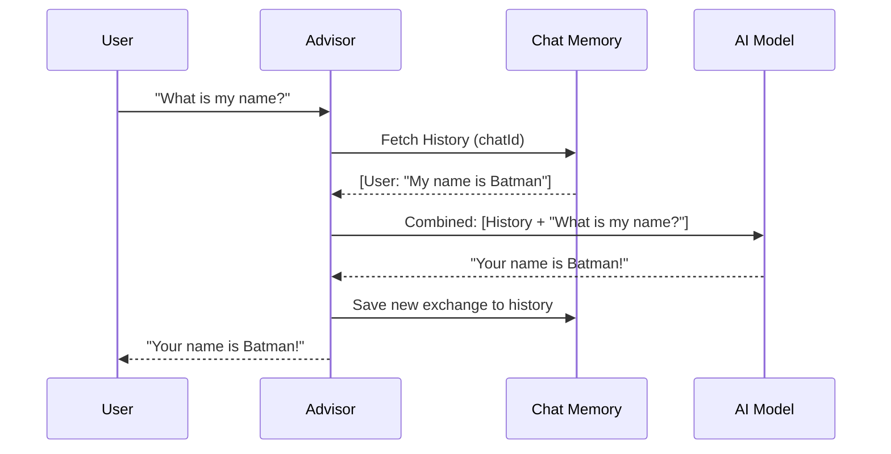

# Scenario 105: Conversational Memory 🧠

## 🎯 Goal
LLMs are **stateless**. Every message you send is like the first time the AI has ever met you. In this scenario, we learn how to give the AI a "Long-Term Memory" (for the duration of a session) so it can remember previous context.

This scenario teaches you how to:
1.  **Understand Statelessness**: Why the AI forgets your name by default.
2.  **Implement ChatMemory**: Using `MessageWindowChatMemory` to store history.
3.  **Apply Advisors**: using `MessageChatMemoryAdvisor` to automatically handle history.

---

## 🎭 The Analogy: The Goldfish vs. The Assistant

*   **Standard AI (The Goldfish)**: Every time you look at the goldfish, it says "Hello!" as if it's the first time. You tell it your name is John. You look away, look back, and it says "Hello! Who are you?".
*   **Memory AI (The Personal Assistant)**: The assistant has a notepad. When you say "My name is John," they write it down. Next time you ask "Who am I?", they look at their notes and say "You are John!".

---

## 🏗️ How the Memory Flows

The `MessageChatMemoryAdvisor` acts as a "Middleman" between your prompt and the AI model.



---

## 🏗️ The Code

### 1. The Configuration (`Scenario105Config.java`)
We define a `ChatMemory` bean. We use a builder to specify the repository and the window size (how many messages to remember).

```java
@Bean
public ChatMemory chatMemory() {
    return MessageWindowChatMemory.builder()
            .chatMemoryRepository(new InMemoryChatMemoryRepository())
            .maxMessages(10) // Memory window size
            .build();
}
```

### 2. The Controller (`Scenario105Controller.java`)
We use the `MessageChatMemoryAdvisor` via its builder. Note that we link it to a specific `chatId`. 

```java
return chatClient.prompt()
        .user(message)
        .advisors(
                MessageChatMemoryAdvisor.builder(chatMemory)
                        .conversationId(chatId) // Links memory to this specific session
                        .build())
        .call()
        .content();
```

---

## 🧪 How to Test

### 1. The Setup (Introduce Yourself)
```bash
curl "http://localhost:8081/spring-ai/api/scenario105/chat?chatId=user_a&message=My name is Bruce Wayne"
```

### 2. The Payoff (Ask the Secret)
Note that we use the **same `chatId`**.
```bash
curl "http://localhost:8081/spring-ai/api/scenario105/chat?chatId=user_a&message=What is my real identity?"
```
**Expected Result**: "You are Bruce Wayne!"

### 3. The Isolation Test
Ask the same question with a **different `chatId`**.
```bash
curl "http://localhost:8081/spring-ai/api/scenario105/chat?chatId=user_b&message=What is my real identity?"
```
**Expected Result**: The AI will have no idea who you are!

---

## 💡 Production Tip
In production environment with multiple pods, `InMemoryChatMemoryRepository` will **not work** if the next request hits a different pod. Use `RedisChatMemoryRepository` or `JdbcChatMemoryRepository` for distributed systems.
