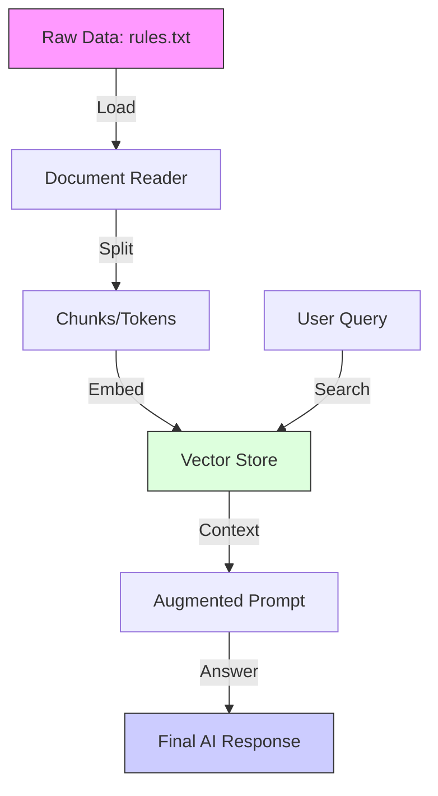

# Scenario 106: RAG (Retrieval Augmented Generation) 📚

## 🎯 Goal
LLMs have a "Knowledge Cutoff" and no access to your private company data. **RAG** bridges this gap by allowing the AI to "look up" facts from your own documents before answering a question.

This scenario teaches you how to:
1.  **Understand Vector Stores**: How text is stored as mathematical vectors for semantic search.
2.  **Implement ETL**: Loading a text file, splitting it into chunks, and storing it.
3.  **Use Retrieval Advisors**: Automatically finding the right facts for a user's question.

---

## 🎭 The Analogy: The Researcher in a Library

*   **Standard AI (The Wise Sage)**: Knows everything up to a certain date, but has no books in front of them. If you ask about a new company policy, they will hallucinate (guess).
*   **RAG AI (The Researcher)**: Has a desk covered in your company's latest manuals. When you ask a question, they first search the library, find the relevant page, read it, and THEN answer you using those facts.

---

## 🏗️ The RAG Flow (ETL)



---

## 🏗️ The Code

### 1. The Vector Store Bean (`Scenario106Config.java`)
We use `SimpleVectorStore`, which is a light, in-memory database. To make it work, it needs an `EmbeddingModel`. We use the builder pattern for initialization.

```java
@Bean
public VectorStore vectorStore(EmbeddingModel embeddingModel) {
    return SimpleVectorStore.builder(embeddingModel).build();
}
```

### 2. The Retrieval Advisor (`Scenario106Controller.java`)
The `QuestionAnswerAdvisor` handles the retrieval process automatically. We attach it to the `ChatClient`.

```java
public Scenario106Controller(ChatClient.Builder builder, VectorStore vectorStore) {
    this.chatClient = builder
            .defaultAdvisors(
                    QuestionAnswerAdvisor.builder(vectorStore).build()
            )
            .build();
}
```

---

## 🧪 How to Test

We have loaded a "Secret Company Policy" from `rules.txt`.

### 1. Ask about the private policy
```bash
curl "http://localhost:8081/spring-ai/api/scenario106/chat?message=What happens on alternate Fridays?"
```

**Expected Result**: The AI should mention **"Deep Coding days"** (from your `rules.txt` file), something it wouldn't know otherwise!


---

## 🛠️ Dependency Breakdown

To make RAG work, we added three specific layers in our `pom.xml`:

| Dependency | Role | Description |
| :--- | :--- | :--- |
| **`spring-ai-starter-model-google-genai-embedding`** | **The Translator** | Calls Google's **Embedding Model** (e.g., `text-embedding-004`) to turn your text into mathematical Vectors. |
| **`spring-ai-vector-store`** | **The Librarian** | Provides the `VectorStore` database (in our case, `SimpleVectorStore`) to store those Vectors. |
| **`spring-ai-advisors-vector-store`** | **The Researcher** | Provides the **`QuestionAnswerAdvisor`**, which automatically searches the Librarian before the AI answers. |

---

## 💡 Production Tip
For high-performance RAG:
1.  **Chunking**: Don't load huge files at once. Split them into 500-token chunks so the AI doesn't lose context.
2.  **External Stores**: Use **Pinecone**, **Milvus**, or **PGVector** for persistent, scalable storage.
