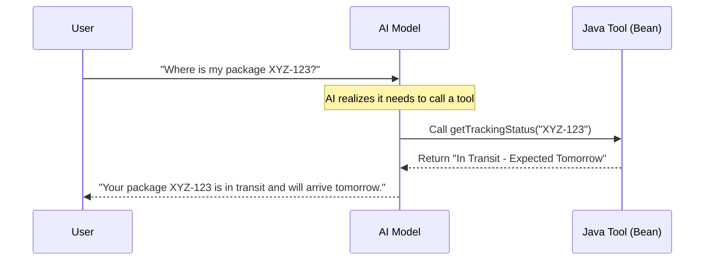

# Scenario 107: AI Function Calling (Tool Use) 🛠️🦾

## 🎯 Goal
Up until now, the AI has only been talking. In this scenario, we give the AI **"Hands"** so it can *do things*—like checking a database or a package status.

This scenario teaches you how to:
1.  **Define Tool Beans**: Creating Java functions that the AI can understand.
2.  **Metadata Magic**: Using `@Description` to "advertise" your functions to the LLM.
3.  **ChatClient Integration**: Registering tools so the AI can call them dynamically.

---

## 🎭 The Analogy: The Executive Assistant with a Phone ☎️

- **Standard AI (The Knowledge Base)**: They know things, but they can't do anything for you. If you ask "Where is my ordered pizza?", they don't have the phone to call the pizza shop.
- **Tool-Enabled AI (The Executive Assistant)**: They have the phone. When you ask "Where is my pizza?", they realize they need more info, *pick up the phone* (call your Java method), get the data, and then report back to you.

---

## 🏗️ The Execution Flow



---

## 🏗️ Implementation Details

### 1. Defining the Tool Component (`Scenario107Config.java`)
We define a Java component and use the `@Tool` annotation on a method. The AI use this description to decide when to call the tool.

```java
@Component
public class Scenario107Config {
    @Tool(description = "Get the current tracking status of a delivery package using its trackingId")
    public PackageResponse trackingFunction(PackageRequest request) {
        // ... logic ...
    }
}
```

### 2. Registering with the `ChatClient` (`Scenario107Controller.java`)
We inject the tool bean directly into the controller and register it at the **Builder** level. This makes the tool available for all calls made by this specific client.

```java
public Scenario107Controller(ChatClient.Builder builder, Scenario107Config trackingTools) {
    this.chatClient = builder
            .defaultTools(trackingTools) // ✅ Injecting the bean instance
            .build();
}

@GetMapping("/track")
public String track(String message) {
    return chatClient.prompt()
            .user(message)
            .call()
            .content();
}
```

---

## 🧪 How to Test

### 1. Ask about a specific package
```bash
curl "http://localhost:8081/spring-ai/api/scenario107/track?message=Where is package XYZ-123?"
```
**Expected Result**: The AI should correctly call the tool and say "Your package XYZ-123 is shipped and arriving Friday."

### 2. Ask about an unknown package
```bash
curl "http://localhost:8081/spring-ai/api/scenario107/track?message=Where is package ABC-999?"
```
**Expected Result**: The AI should report that the tracking ID was not found.

---

## 💡 Production Tip
- **Precise Descriptions**: If your function description is bad (e.g., "Check status"), the AI might call it for everything. Be specific: "Get the status of a delivery package given its tracking ID."
- **Small Return Types**: Don't return a massive JSON blob. The AI has a token limit. Only return the necessary fields.
