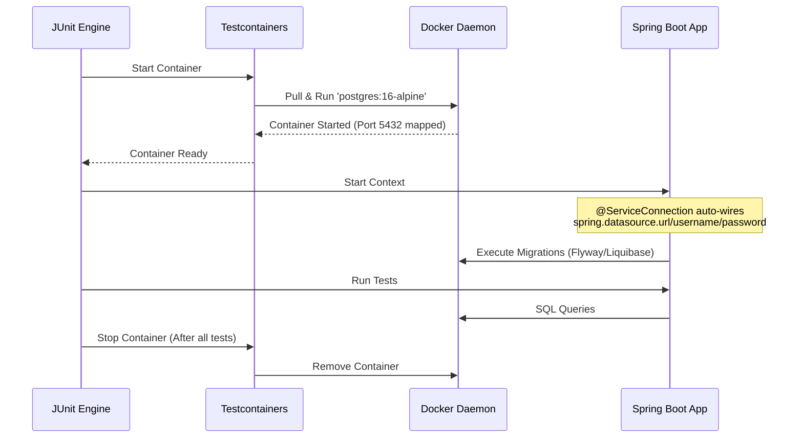

# Scenario 121: Testcontainers (Database Integration Testing)

Integration testing with a real database is crucial for catching database-specific issues (like SQL syntax differences, constraint violations, or transaction behavior) that might not surface when using an in-memory database like H2.

## 🚀 Why Testcontainers?

1.  **Isolation**: Each test execution starts a fresh, isolated container.
2.  **Parity**: Test against the same database engine used in production (e.g., PostgreSQL, MySQL).
3.  **Zero Configuration**: No need to manually install or manage database servers on CI/CD or developer machines.
4.  **Realistic Environment**: Test real indexing, triggers, and complex queries.

---

## 🛠️ Implementation with Spring Boot 3.1+

Spring Boot 3.1 introduced the `@ServiceConnection` annotation, which significantly simplifies the configuration of Testcontainers.

### 1. Dependencies

Add the following to your `pom.xml`:

```xml
<dependency>
    <groupId>org.springframework.boot</groupId>
    <artifactId>spring-boot-testcontainers</artifactId>
    <scope>test</scope>
</dependency>
<dependency>
    <groupId>org.testcontainers</groupId>
    <artifactId>postgresql</artifactId> <!-- Or mysql, etc. -->
    <scope>test</scope>
</dependency>
```

### 2. The `@ServiceConnection` Pattern

Before `@ServiceConnection`, you had to manually set properties using `@DynamicPropertySource`. Now, it's automatic:

```java
@SpringBootTest(webEnvironment = SpringBootTest.WebEnvironment.RANDOM_PORT)
@Testcontainers
class MyIntegrationTest {

    @Container
    @ServiceConnection
    static PostgreSQLContainer<?> postgres = new PostgreSQLContainer<>("postgres:16-alpine");

    @Test
    void connectionEstablished() {
        assertThat(postgres.isCreated()).isTrue();
        assertThat(postgres.isRunning()).isTrue();
    }
}
```

---

## 📊 Lifecycle Diagram



---

## 🚀 How to Run

Ensure **Docker** is running, then execute:

```bash
mvn test -Dtest=Scenario121IntegrationTest
```

## 📝 Interview Tip
> "How does @ServiceConnection simplify Testcontainers usage?"
>
> It eliminates the need for `@DynamicPropertySource` by automatically discovering the container's metadata (IP, port, credentials) and injecting them into Spring's Environment properties (like `spring.datasource.url`). This makes the test code much cleaner and less error-prone.
