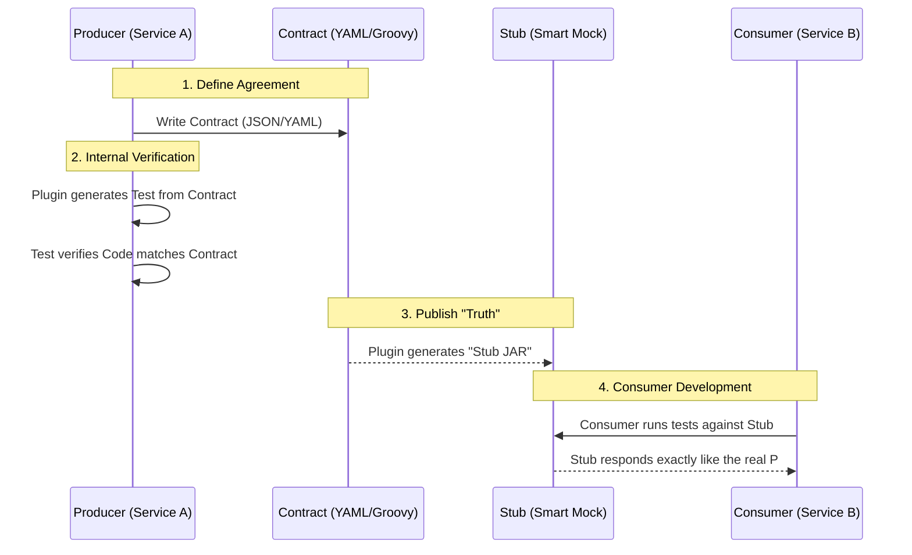

# Scenario 133: Spring Cloud Contract (CDCT)

This scenario covers **Consumer-Driven Contract Testing (CDCT)**. In a microservices world, this is the "gold standard" for ensuring services can talk to each other without breaking.

---

## 🎭 The Real-World Analogy: The Restaurant Order

Imagine you are at a restaurant.

1.  **The Contract (The Menu)**: The menu is a "Contract" between the Kitchen (**Producer**) and the Customer (**Consumer**). It says: "If you ask for 'Item #5', we will give you a 'Burger' for '10 Dollars'".
2.  **The Producer's Duty (The Kitchen)**: The Chef must ensure that whenever someone orders #5, they actually send out a Burger. They can't suddenly start sending out Tacos without updating the menu first.
3.  **The Consumer's Duty (The Customer)**: The customer assumes they will get a Burger. They might even prepare their table with ketchup and napkins specifically for a burger.
4.  **The "Integration Hell" (The Breakage)**: If the Kitchen changes #5 to a Salad but *doesn't change the menu*, the Customer is left with a table full of ketchup and no burger. **Their "Integration" broke.**

**Spring Cloud Contract** is the "Menu Manager" that forces the Kitchen to test itself against the Menu before the waiter even takes an order.

---

## 🛠️ The Core Concept

In distributed systems, we often use **Mocks**. However, regular Mocks are "dumb"—if the real service changes its API, your Mocks stay the same, and your tests pass even though the production code will fail.

**Spring Cloud Contract** solves this by making Mocks "Smart" (called **Stubs**).

### The Workflow Diagram

---

## 📋 Key Topics

### 1. The Contract
The contract is a simple file (YAML or Groovy) that defines the expected **Input** (Request) and **Output** (Response). 
- **Request**: Method, Path, Headers, Body.
- **Response**: Status Code, Headers, Body.

### 2. Producer-Side (The Source of Truth)
The Producer owns the contract. A Maven plugin reads the contract and:
- **Generates Tests**: It creates actual JUnit tests! These tests call the Producer's own controllers to make sure they return exactly what the contract promises.
- **Builds Stubs**: If the tests pass, it packages a "Stub" (a WireMock JSON file) into a special `.jar` file.

### 3. Consumer-Side (The User)
The Consumer doesn't need the Producer's code to run. They use **Stub Runner**:
- It "downloads" the Stub JAR from the Producer.
- It starts a local mock server (WireMock).
- The Consumer's tests hit this mock server.
- **Why it's better than Mocking?** Because if the Producer changes the API and breaks the contract, the Producer's build will fail. This means the Stubs will never be updated with the "broken" version, protecting the Consumer.

---

## 🚀 Why do we use it in Production?

- **Decoupling**: You don't need to spin up 10 microservices on your laptop to test one small change.
- **Reliability**: You catch "Communication Breakdowns" in the Build phase, not in Production.
- **Documentation**: The contracts serve as live, executable documentation of how the API behaves.

---

### 💡 Interview Tip: "Consumer-Driven" vs "Producer-Driven"
*   **Producer-Driven**: The Producer tells you "Here is my API, deal with it." (Most common).
*   **Consumer-Driven**: The Consumer says "I need the API to look like THIS." They send the contract to the Producer. The Producer implements the code until the contract-tests pass. **This is the true spirit of CDCT.**
