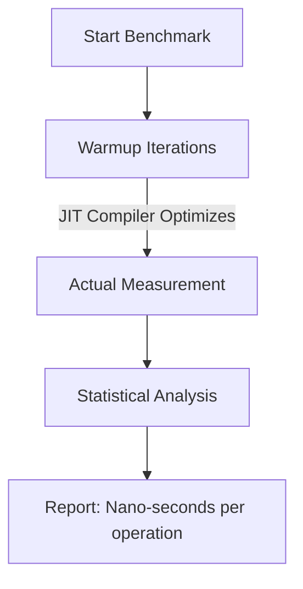

# Scenario 135: JMH (Java Microbenchmark Harness)

This scenario covers **JMH**, the specialized framework used for accurate performance benchmarking on the JVM.

---

## 🎭 The Real-World Analogy: The Formula 1 Wind Tunnel

Imagine you want to know if a new spoiler makes your car faster.

#### 1. The "Basement" Test (Bad Benchmarking)
You take your car out to a local street, use your phone’s stopwatch, and floor it. 
*   **The Problem**: There’s wind, there’s traffic, the engine wasn't warm on the first run but was hot on the second, and your thumb was a bit slow on the button. Your "data" is useless.
*   **Software equivalent**: Surrounding a piece of code with `System.currentTimeMillis()`. The JVM "warms up" code as it runs, meaning the first 10,000 runs are slower than the next million. A simple timer won't capture the real speed.

#### 2. The JMH Test (The Wind Tunnel)
You take the car to a controlled, state-of-the-art wind tunnel. The temperature is constant, sensors measure speed down to the millisecond, and the car "warms up" for 2 hours before the real test begins. 
*   **Result**: You get scientifically accurate data that accounts for every variable.
*   **Software equivalent**: JMH runs "Warmup" iterations to let the JIT (Just-In-Time) compiler optimize the code, then runs "Measurement" iterations, and calculates averages with statistical confidence.

---

## 🛠️ The Core Concept

Benchmarking on the JVM is notoriously difficult because of:
1.  **Warm-up**: Code runs faster after it has been executed thousands of times.
2.  **Dead Code Elimination**: The JVM might realize a piece of code does nothing and simply "delete" it during optimization, making it look like it runs in 0ns.
3.  **OS Jitter**: Background tasks on your computer can spike the CPU for a millisecond.

### The JMH Solution:



---

## 📊 Why do we use it in Production?

- **Comparing Algorithms**: Should we use a `HashMap` or a `TreeMap` for this specific 500-item list?
- **Optimizing Hot-Paths**: In a high-frequency trading app or a payment gateway, 50 nanoseconds saved can be worth millions.
- **Avoiding Regressions**: Ensuring a new "clean code" refactor didn't accidentally make the core logic 2x slower.

---

## ⚠️ The "Black Hole"
In JMH, if you write a method like `void test() { int result = 1 + 1; }`, the JVM will optimize it away to nothing. To prevent this, JMH provides a **Blackhole** object. You "feed" your result to the blackhole so the JVM thinks the result is being used and doesn't delete your code!

```java
@Benchmark
public void testMethod(Blackhole bh) {
    int sum = someCalculation();
    bh.consume(sum); // Keeps the code "alive" for the test
}
```

---

### 💡 Interview Tip: How do you measure performance?
Never say "I use `currentTimeMillis()`." Instead, say: **"I use JMH for microbenchmarking to ensure JIT warm-up and dead-code elimination are properly handled for statistically significant results."**
