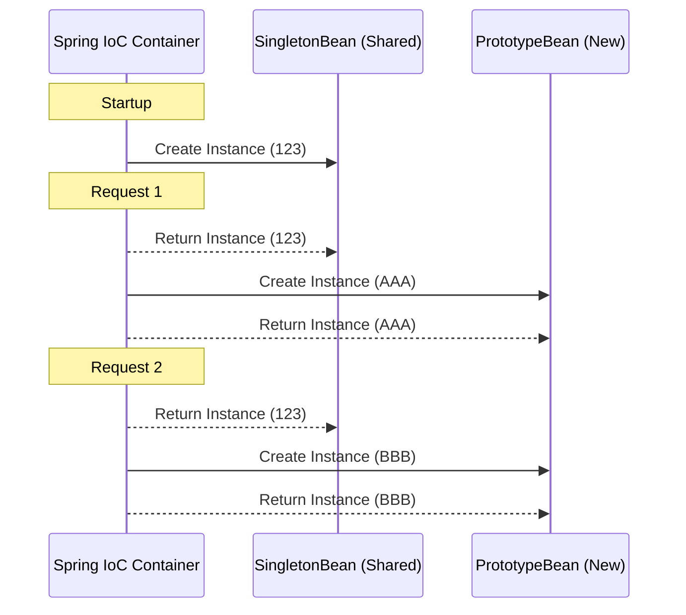

# Scenario 02: Mastering Bean Scopes

## Overview
In Spring, a **Bean Scope** defines the lifecycle and visibility of a bean instance within the IoC (Inversion of Control) container. Understanding these is critical for managing memory, thread safety, and application state.

---

## 🔬 The Two Pillars

1.  **Singleton (Default)** 🌍: 
    -   Spring creates exactly **one** instance of the bean. 
    -   Every time you ask for the bean (via `@Autowired` or `applicationContext.getBean()`), you get the **exact same object**.
    -   **Best for**: Stateless services, repositories, and controllers.

2.  **Prototype** 🧊:
    -   Spring creates a **new** instance every single time the bean is requested.
    -   Spring does **not** manage the full lifecycle of prototype beans (it initializes them but doesn't call `@PreDestroy`).
    -   **Best for**: Statefull objects or beans that maintain data unique to a specific task.

---

## 🏗️ The Mermaid Flow: Singleton vs Prototype



---

## 🧨 The Senior Interview Trap: Prototype in Singleton
If you inject a `@Scope("prototype")` bean into a `@Component` (which is Singleton) using `@Autowired`, **the prototype bean will only be created once!**

-   **Why?** Because the Singleton bean is only initialized once, and its dependencies are injected during that single initialization.
-   **The Fix**: Use `ObjectFactory<MyPrototypeBean>` or `ApplicationContext.getBean()` to manually pull a fresh instance when needed.

---

## Testing the Scenario
Use this `curl` command to see the IDs in action:

```bash
curl http://localhost:8080/debug-application/api/scenario2/test
```

### Expected Output:
```json
{
  "singleton_ids": {
    "instance_1": "same-uuid-123",
    "instance_2": "same-uuid-123"
  },
  "prototype_ids": {
    "instance_1": "unique-uuid-AAA",
    "instance_2": "unique-uuid-BBB"
  }
}
```
*(Notice how the Singleton IDs match, but the Prototype IDs are generated fresh for every call).*
