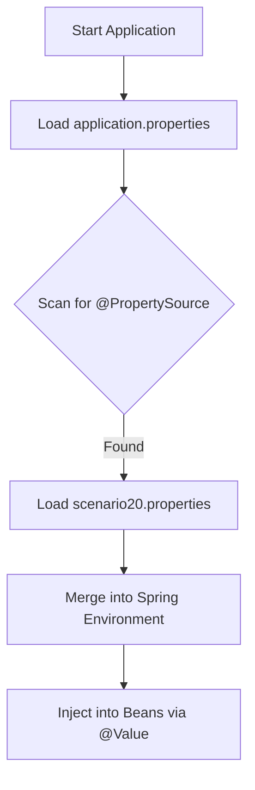

# Scenario 20: Custom @PropertySource & External Config

## Overview
By default, Spring Boot loads properties from `application.properties` (or `.yml`). However, in large applications, you often want to **modularize** your configuration (e.g., have a separate file for Email settings, another for Third-party APIs).

This scenario demonstrates how to use the **`@PropertySource`** annotation to load a custom properties file into the Spring `Environment`.

---

## ⚙️ The Mechanics: How it works
1.  **The File**: We created `src/main/resources/scenario20.properties`.
2.  **The Trigger**: The `@PropertySource("classpath:scenario20.properties")` annotation tells Spring: *"Hey, look into this file and add its keys to the application's environment."*
3.  **The Usage**: Once loaded, you can inject these values using `@Value("${...}")` or by accessing the `Environment` bean.

---

## 🗺️ Configuration Flow



---

## 🧪 Testing the Scenario
Run this `curl` command to see the values loaded from the custom file:

```bash
curl http://localhost:8080/debug-application/api/scenario20/config
```

### Expected Output:
```json
{
  "app_name": "The Debug Challenge - Externalized",
  "app_version": "v2.0-CUSTOM",
  "description": "This value was loaded using @PropertySource from a separate file!",
  "source": "@PropertySource(scenario20.properties)"
}
```

---

## Interview Tip 💡
**Q**: *"Does @PropertySource work with YAML files?"*
**A**: *"No, not by default. The standard `@PropertySource` only supports `.properties` and `.xml` files. To load a YAML file using this annotation, you would need to implement a custom `PropertySourceFactory`. Alternatively, for YAML, it's better to use the `spring.config.import` property in your main application config."*
