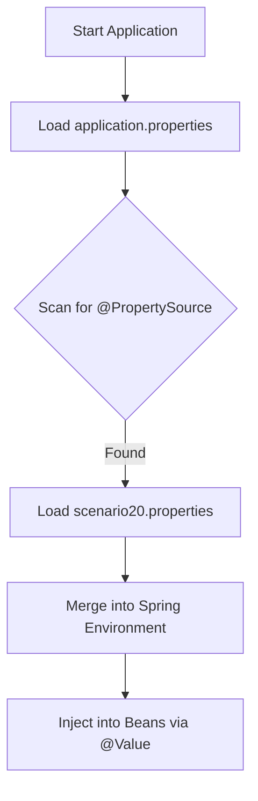

# Scenario 20: Custom @PropertySource & External Config

## Overview
By default, Spring Boot loads properties from `application.properties` (or `.yml`). However, in large applications, you often want to **modularize** your configuration (e.g., have a separate file for Email settings, another for Third-party APIs).

This scenario demonstrates how to use the **`@PropertySource`** annotation to load a custom properties file into the Spring `Environment`.

---

## ⚙️ The Mechanics: How it works
1.  **The File**: We created `src/main/resources/scenario20.properties`.
2.  **The Trigger**: The `@PropertySource("classpath:scenario20.properties")` annotation tells Spring: *"Hey, look into this file and add its keys to the application's environment."*
3.  **The Usage**: Once loaded, you can inject these values using `@Value("${...}")` or by accessing the `Environment` bean.

---

## 🗺️ Configuration Flow



---

## ⚔️ The Comparison: @Value vs @ConfigurationProperties

| Feature | `@Value` 🎯 | `@ConfigurationProperties` 🏗️ |
| :--- | :--- | :--- |
| **Usage** | Individual, ad-hoc properties | Structured, prefixed groups |
| **Type Safety** | No (String-based) | **Yes** (Strictly typed) |
| **Relaxed Binding** | Limited | **Full** (camelCase, kebab-case) |
| **Validation** | No | **Yes** (JSR-303 support) |

---

## 🛠️ Mixed Implementation
In `Scenario20Config.java`, we demonstrate both styles loading from the same external file:
- **Style 1 (@Value)**: For simple metadata like `app.name`.
- **Style 2 (@ConfigurationProperties)**: For structured blocks like `server.*`.

---

## 🧪 Testing the Scenario
Run this `curl` command to see data from both injection styles:

```bash
curl http://localhost:8080/debug-application/api/scenario20/config
```

### Expected Output:
```json
{
  "via_value_annotation": {
    "name": "The Debug Challenge - Externalized",
    "version": "v2.0-CUSTOM",
    "description": "This value was loaded using @PropertySource from a separate file!"
  },
  "via_configuration_properties": {
    "host": "127.0.0.1",
    "port": 8081,
    "timeout": 5000
  },
  "analysis": "Use @Value for ad-hoc properties; use @ConfigurationProperties for structured, type-safe groups."
}
```

---

## Interview Tip 💡
**Q**: *"When should you prefer @ConfigurationProperties over @Value?"*
**A**: *"Prefer `@ConfigurationProperties` for related settings with a common prefix. It offers type-safety and relaxed binding. Use `@Value` only for isolated properties or when you specifically need SpEL (Spring Expression Language) support."*

**Q**: *"Does @PropertySource work with YAML files?"*
**A**: *"No, not by default. The standard `@PropertySource` only supports `.properties` and `.xml` files. To load a YAML file using this annotation, you would need to implement a custom `PropertySourceFactory`."*
