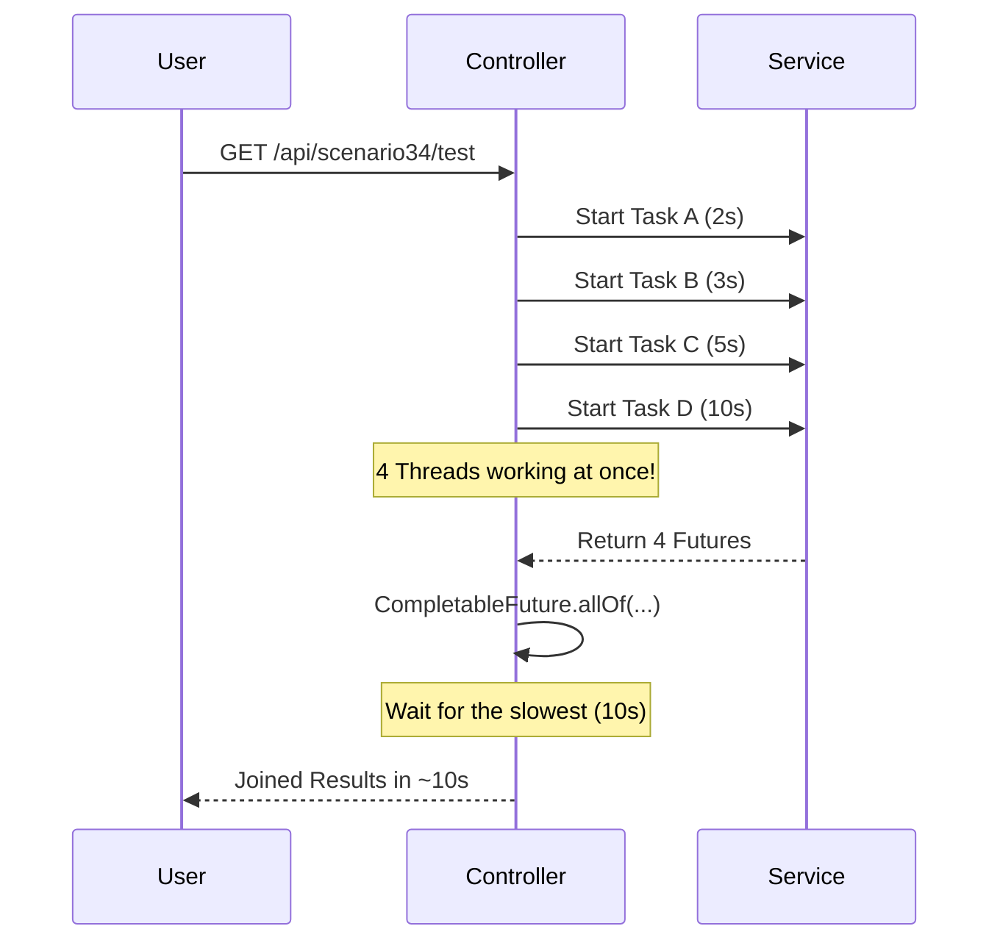
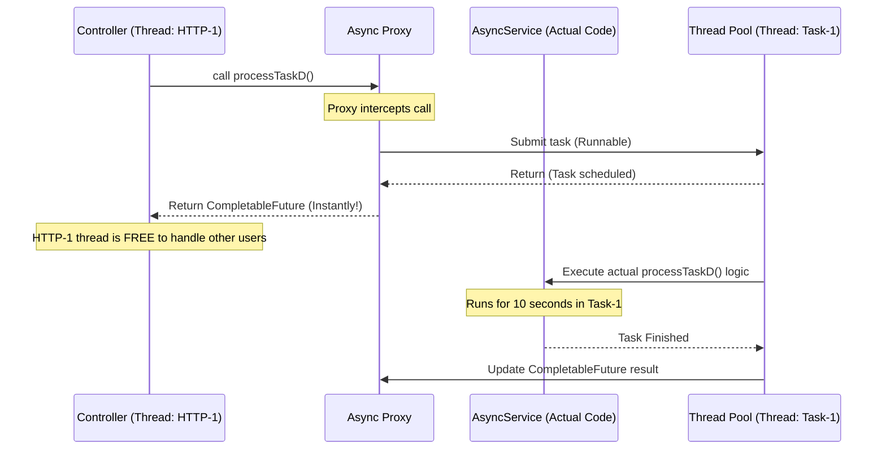

# Scenario 34: Async Return Types (CompletableFuture)

## Overview
While `@Async` is great for "Fire and Forget" tasks, many real-world scenarios require gathering results from multiple background tasks to build a final response. This scenario demonstrates how to use the modern **`CompletableFuture`** to achieve non-blocking parallel processing.

---

## 🏎️ Parallel Flow Visualization (Deep Parallelism)



---

## 📊 Performance Comparison

| Execution Mode | Logic | Total Wait Time |
| :--- | :--- | :--- |
| **Sequential** | 2s + 3s + 5s + 10s | **20 Seconds** 🐢 |
| **Parallel (Async)** | **max**(2s, 3s, 5s, 10s) | **10 Seconds** 🚀 |

---

## 🧪 Testing the Scenario
Run this `curl` command to see the results of deep parallel execution:

```bash
curl http://localhost:8080/debug-application/api/scenario34/test
```

### Observation 🔍
The `total_time_ms` in the response will be around **10,000ms**. 
This proves that even though we performed **20 seconds of work**, the user only waited for the longest single task to complete.

---

## 🏗️ Behind the Scenes: The Proxy Pattern

Spring's `@Async` relies on **AOP Proxies**. When you call an `@Async` method, you are actually calling a generated proxy that handles the thread handoff. This is identical to how `@Transactional` and `@Cacheable` work!



### ⚔️ Feature Comparison: AOP Proxies

| Feature | Proxy's Job | Result of Self-Invocation |
| :--- | :--- | :--- |
| **`@Async`** | Handoff to a worker thread | Runs on **Caller's** thread (blocking) 🐢 |
| **`@Transactional`** | Start/Commit/Rollback TX | No Transaction started ❌ |
| **`@Cacheable`** | Lookup/Store in Cache | Cache ignored; DB called directly 🛑 |

---

## 🚨 The "Self-Invocation" Pitfall
**Q**: *"What happens if I call an @Async method from another method inside the same class?"*  
**A**: It runs **synchronously**. 

**Why?** Because a self-call (`this.method()`) bypasses the Spring Proxy. Since the proxy is responsible for the thread-switching logic, bypassing it means the code runs sequentially in your main thread.

### 🛠️ How to Fix it?
1. **The Clean Way (Best Practice)**: Move the async method to a separate "Service" or "Helper" bean.
2. **The "Self-Injection" Hack**: Inject the bean into itself to force a proxy call.

```java
@Autowired
private MyService self; // Self-injecting the proxy!

public void doWork() {
    self.asyncMethod(); // This works because it hits the proxy!
}
```

---

## Interview Tip 💡
**Q**: *"What happens if one of the parallel tasks fails?"*
**A**: *"In `CompletableFuture.allOf()`, if any one task completes exceptionally, the combined future also completes exceptionally. You can use `.exceptionally()` or `.handle()` to provide fallback values for individual tasks or the entire chain."*

**Q**: *"Does Spring use a new thread for every @Async call?"*
**A**: *"It depends on the TaskExecutor configuration. By default, it uses a `ThreadPoolTaskExecutor` (named `applicationTaskExecutor`). You should customize this pool for production to prevent memory exhaustion."*
