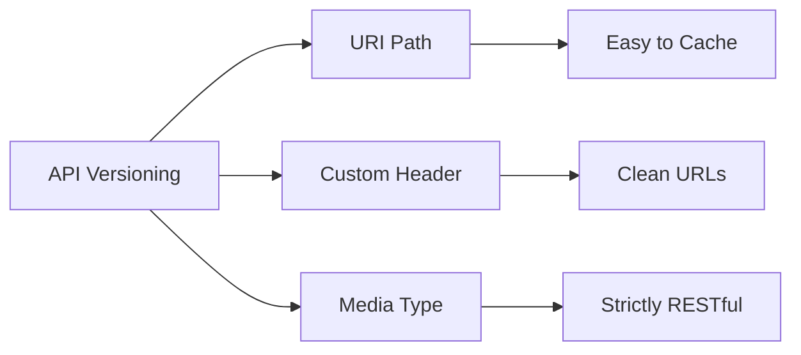

# Scenario 38: API Versioning Strategies

## Overview
As APIs evolve, breaking changes are inevitable. **Versioning** allows you to introduce new features while maintaining backward compatibility for existing clients. This scenario demonstrates the three most common ways to version APIs in Spring Boot.

---

## 🚦 The Three Strategies

### 1. URI Versioning (Path-based) 🛣️
-   **Example**: `GET /api/v1/users` vs `GET /api/v2/users`
-   **Pros**: Most popular, easy to read, browse-friendly, works well with CDNs and caching.
-   **Cons**: Changes the URL; clutters the URI space.
-   **Implementation**: Done via `@RequestMapping` or `@GetMapping` paths.

### 2. Request Header Versioning ✉️
-   **Example**: `GET /api/users` with Header `X-API-VERSION: 1`
-   **Pros**: Keeps the URL clean (one URL for one resource); doesn't clutter URI space.
-   **Cons**: Not browser-friendly (hard to test without Postman/curl); bypasses some CDN caching.
-   **Implementation**: Done using the `headers` attribute in `@GetMapping`.

### 3. Media Type Versioning (Accept Header) 🎭
-   **Example**: `GET /api/users` with Header `Accept: application/vnd.company.v1+json`
-   **Pros**: Most "RESTful" (uses standard HTTP content negotiation).
-   **Cons**: High complexity; difficult to test; same caching issues as Header versioning.
-   **Implementation**: Done using the `produces` attribute in `@GetMapping`.

---

## 🎨 Comparison Logic



---

## 🧪 Testing the Scenario

Try these `curl` commands to see the different versions return different results:

1. **URI Versioning**:
```bash
curl http://localhost:8080/debug-application/api/scenario38/v1/test
curl http://localhost:8080/debug-application/api/scenario38/v2/test
```

2. **Header Versioning**:
```bash
curl -H "X-API-VERSION: 1" http://localhost:8080/debug-application/api/scenario38/header/test
curl -H "X-API-VERSION: 2" http://localhost:8080/debug-application/api/scenario38/header/test
```

3. **Media Type Versioning**:
```bash
curl -H "Accept: application/vnd.company.v1+json" http://localhost:8080/debug-application/api/scenario38/media/test
curl -H "Accept: application/vnd.company.v2+json" http://localhost:8080/debug-application/api/scenario38/media/test
```

---

## Interview Tip 💡
**Q**: *"Which versioning strategy is best?"*
**A**: *"There is no single 'best' way. **URI versioning** is the industry standard for public APIs (like GitHub or Twitter) because of its simplicity and caching benefits. However, **Header versioning** is often preferred for internal corporate APIs where keeping a 'Semantic URL' is more important than public cacheability."*
