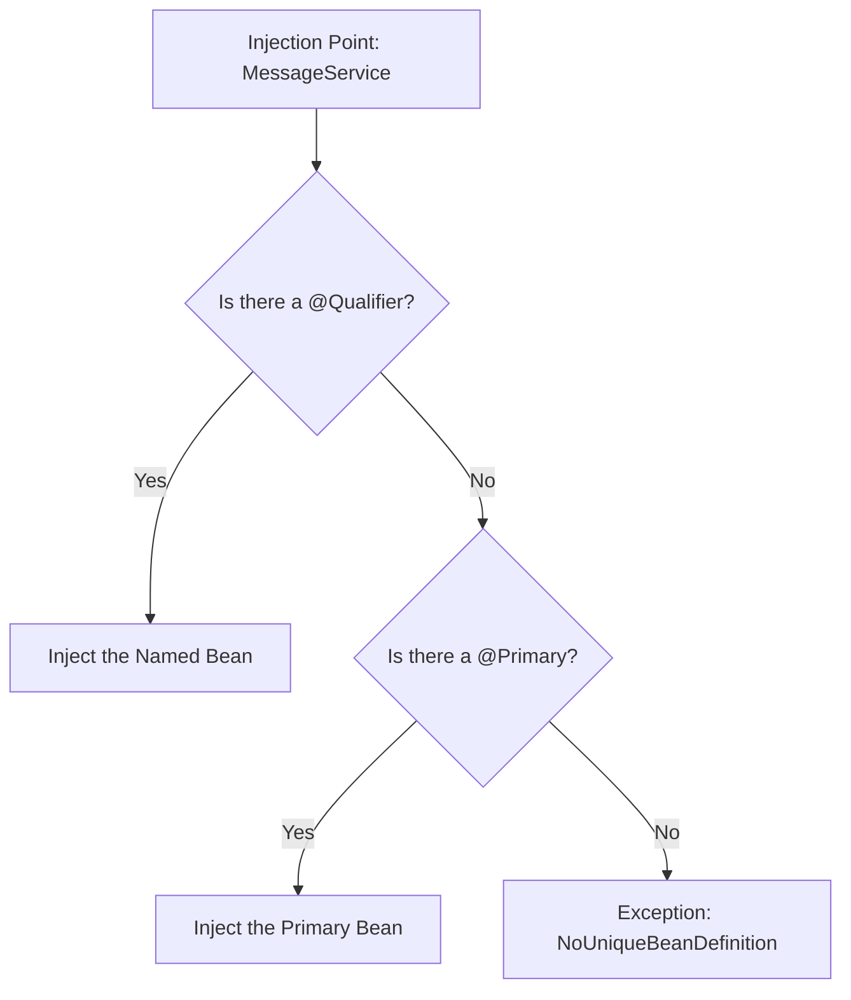

# Scenario 04: Qualifiers & Primary Beans

## Overview
When multiple beans of the same type exist in the Spring context, the IoC container faces **ambiguity**. Unless specified, Spring won't know which one to inject, resulting in the dreaded `NoUniqueBeanDefinitionException`. This scenario demonstrates the two primary ways to resolve this: **@Primary** and **@Qualifier**.

---

## ⚔️ The Conflict: Ambiguity
Imagine an interface `MessageService` with two implementations: `SmsService` and `EmailService`. If you `@Autowired MessageService`, Spring sees two candidates and panics.

### 1. The Peacemaker: @Primary 🍞
-   **What it is**: Marks a bean as the "default" choice.
-   **Behavior**: If multiple beans exist, Spring will pick the `@Primary` one unless a specific name is requested.
-   **Use Case**: When you have a standard implementation but occasionally need specialized ones.

### 2. The Sniper: @Qualifier 🎯
-   **What it is**: Allows you to pick a bean by its specific name/ID.
-   **Behavior**: Overrides `@Primary`. It tells Spring exactly which bean you want at a specific injection point.
-   **Use Case**: When you need a specific implementation for a specific part of your app (e.g., using a "cloud" storage bean instead of "local").

---

## 🏗️ The Mermaid Logic: Disambiguation



---

## 🧪 Testing the Scenario
Run this `curl` command to see Spring resolving both beans in the same controller:

```bash
curl http://localhost:8080/debug-application/api/scenario4/test
```

### Expected Output:
```json
{
  "default_bean_response": "SMS Sent: Hello from the Primary Bean!",
  "qualified_bean_response": "Email Sent: Hello from the Qualified Bean!",
  "analysis": "The default service used @Primary (SMS), while the specific service used @Qualifier (Email)."
}
```

---

## Interview Tip 💡
**Q**: *"What happens if you have two beans of the same type and both are marked with @Primary?"*
**A**: *"Spring will throw a `BeanDefinitionStoreException` during startup because it cannot determine a single primary candidate. Ambiguity must be resolved by either removing one `@Primary` or using `@Qualifier` at the injection point."*
