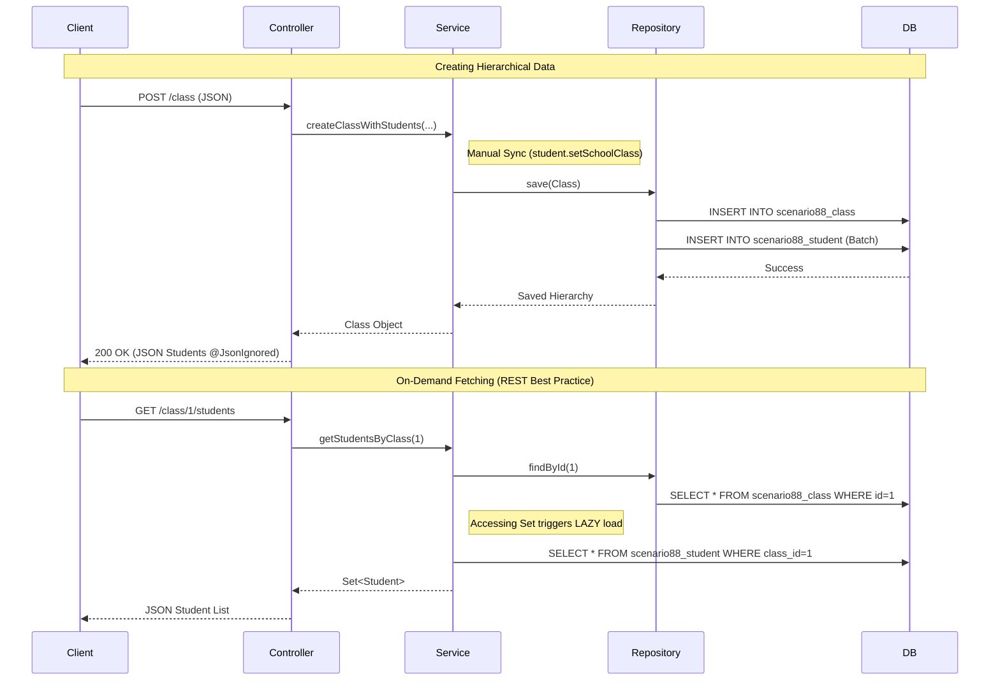

# Scenario 88: One-to-Many & Many-to-One Masterclass

## Overview
A **One-to-Many** relationship is the most common pattern in database design (e.g., One User has many Posts, One Order has many Items). In JPA, this is typically implemented as a **bidirectional** relationship.



---

## 🏫 Analogy: The Teacher and the Class

1.  **The One Side (Teacher/Class)**: One teacher manages a whole group. In code, the `SchoolClass` has a `Set<Student>`. This is the **Inverse Side** (`mappedBy`).
2.  **The Many Side (Students)**: Many students belong to one teacher. In the database, the `STUDENT` table holds the `class_id` foreign key. This is the **Owning Side**.

---

## Key Concepts 🛠️

### 1. Owning vs. Inverse (The `mappedBy` Rule)
In a One-to-Many relationship, the **Many** side (Student) is almost always the **Owner** because it holds the Foreign Key.
-   The `@OneToMany` side must use `mappedBy` to point to the field name in the Student class.

### 2. Why use `Set` instead of `List`? 🚀
Using `java.util.List` for a collection of students can be inefficient. If you remove one student from a List, Hibernate often **deletes all students** from the table and **re-inserts** the remaining ones.
-   **Fix**: Use `java.util.Set`. It allows Hibernate to perform a single `DELETE` or `UPDATE` statement, which is much faster.

### 3. Synchronization Helper Methods
When you add a student to a class in Java, you must update **both sides** of the relationship so that your memory state matches the database.
```java
public void addStudent(Student student) {
    this.students.add(student); // Update Class side
    student.setSchoolClass(this); // Update Student side
}
```

### 4. Fetch Strategy: LAZY
By default, `@OneToMany` is **LAZY**. This means if you load a Class, the Students aren't loaded until you actually call `getClass().getStudents()`. This prevents loading thousands of rows unnecessarily.

---

## Testing the Scenario
Use these `curl` commands:

1. **Create Class with Students**:
   ```bash
   curl -X POST http://localhost:8080/debug-application/api/scenario88/class \
   -H "Content-Type: application/json" \
   -d '{
     "className": "Java 101",
     "teacherName": "Dr. Spring",
     "students": [
       {"name": "Alice", "rollNumber": "A001"},
       {"name": "Bob", "rollNumber": "B002"}
     ]
   }'
   ```

2. **Fetch Class (Check Lazy Loading in Logs)**:
   ```bash
   curl http://localhost:8080/debug-application/api/scenario88/class/1
   ```

3. **Add Multiple Students (Bulk) to Existing Class**:
   ```bash
   curl -X POST http://localhost:8080/debug-application/api/scenario88/class/1/students \
   -H "Content-Type: application/json" \
   -d '[
     {"name": "Charlie", "rollNumber": "C003"},
     {"name": "Daisy", "rollNumber": "D004"}
   ]'
   ```

4. **Fetch Students On-Demand**:
   (Since we added `@JsonIgnore` to the main class, use this to see students)
   ```bash
   curl http://localhost:8080/debug-application/api/scenario88/class/1/students
   ```

---

## The "On-Demand" Pattern 🧠
In a professional production system (like LinkedIn posts or Amazon orders), you usually **don't** want to fetch all items immediately when you view the parent.
-   **Why?** Performance. If a Post has 10,000 comments, your server will crash trying to send them all in one JSON.
-   **Solution**: Use `@JsonIgnore` on the collection in the parent entity, and provide a **separate endpoint** to fetch the children. This is exactly what we implemented here!
