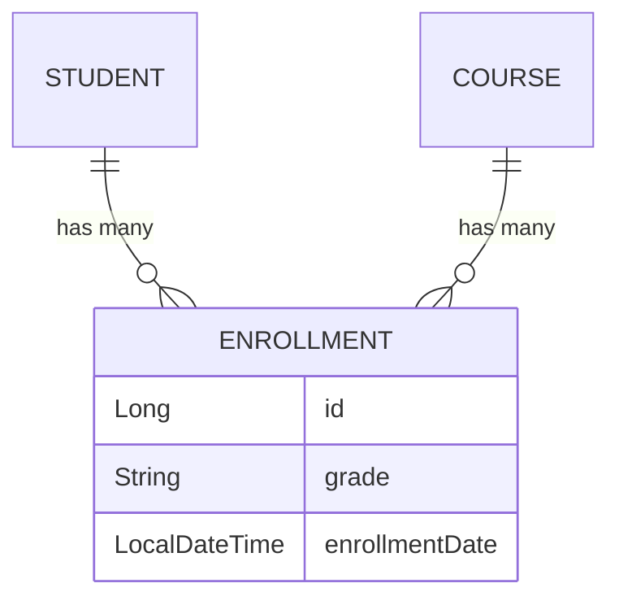

# Scenario 89: JPA Many-to-Many & Intersection Entities

## Overview
A **Many-to-Many** relationship is common (e.g., Students and Courses), but using the basic `@ManyToMany` annotation is often a **limitation** in real-world apps. Most of the time, the relationship itself has attributes (like Enrollment Date or Grade). 

This scenario demonstrates the **Intersection Entity (Bridge Table)** pattern, which is the industry standard for robust Many-to-Many relationships.

---

## 🏗️ The Bridge Table Pattern
Instead of a direct `Student <-> Course` link, we introduce an `Enrollment` entity.
-   **Student** has `@OneToMany` to **Enrollment**.
-   **Course** has `@OneToMany` to **Enrollment**.
-   **Enrollment** has `@ManyToOne` to both **Student** and **Course**.

### Why use this instead of @ManyToMany?
1.  **Extra Fields**: You can store `grade`, `enrollmentDate`, `semester`, etc., on the `Enrollment` entity.
2.  **Explicit Control**: You have full control over when associations are created and deleted.
3.  **Hibernate Performance**: Basic `@ManyToMany` can sometimes lead to inefficient SQL (deleting and re-inserting all rows in the join table).

---

## 🗺️ Mermaid Visualization: The Three-Way Link



---

## 🧪 Testing the Scenario
Use these `curl` commands to see the pattern in action:

1. **Create a Course**:
```bash
curl -X POST http://localhost:8080/debug-application/api/scenario89/course \
-H "Content-Type: application/json" \
-d '{"courseName": "Advanced JPA", "courseCode": "JPA301"}'
```

2. **Create a Student**:
```bash
curl -X POST http://localhost:8080/debug-application/api/scenario89/student \
-H "Content-Type: application/json" \
-d '{"name": "Alice Smith", "email": "alice@example.com"}'
```

3. **Enroll Student in Course (with Grade)**:
```bash
curl -X POST http://localhost:8080/debug-application/api/scenario89/enroll \
-H "Content-Type: application/json" \
-d '{"studentId": 1, "courseId": 1, "grade": "A+"}'
```

4. **Verify Enrollments**:
```bash
curl http://localhost:8080/debug-application/api/scenario89/students
```

---

## Interview Tip 💡
**Q**: *"When should you choose an Intersection Entity over a simple @ManyToMany?"*
**A**: *"Whenever the relationship itself carries data. If you only need to know 'Is A linked to B?', use @ManyToMany. But if you need to know 'When was A linked to B?' or 'What is the status of the link?', you MUST use an Intersection Entity."*
