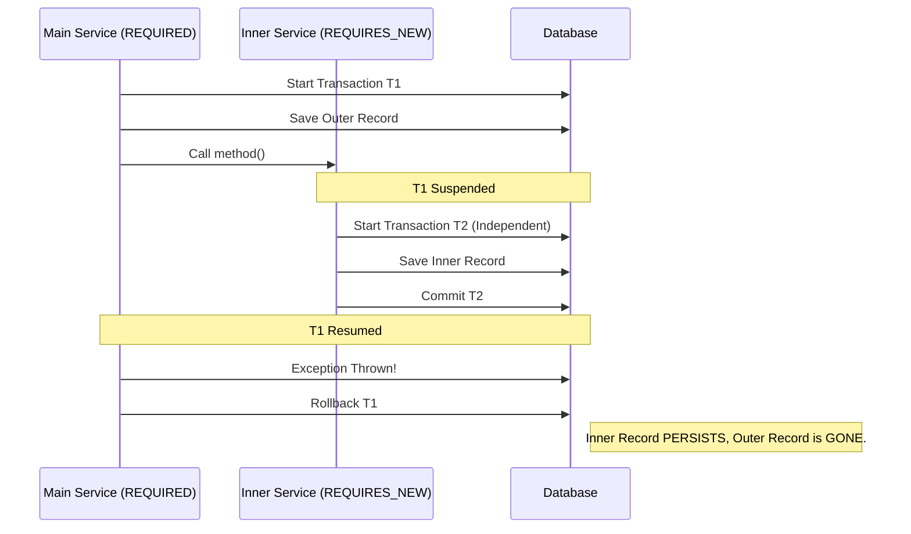
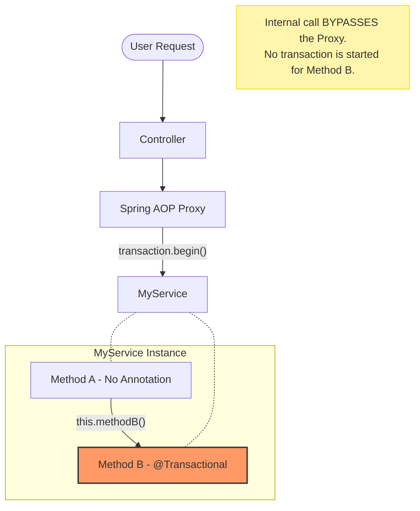
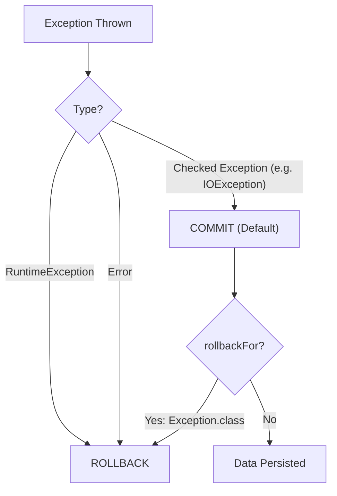

# Scenario 93: @Transactional Deep Dive

## Overview
The `@Transactional` annotation is the heart of Spring's declarative transaction management. While it seems simple, its behavior under different propagation and isolation settings is a frequent source of bugs and a top-tier interview topic.

This scenario covers the 4 critical "Gotchas" of Spring Transactions.

---

## 🏗️ 1. Propagation: REQUIRED vs REQUIRES_NEW
- **`REQUIRED` (Default)**: Joins the existing transaction if one exists.
- **`REQUIRES_NEW`**: Always starts a new transaction. If an outer transaction exists, it is **suspended** until the inner one finishes.

### The Interview Question:
*"If an inner method is `REQUIRES_NEW` and the outer method rolls back, does the inner work persist?"*
**Answer**: Yes. Because they are separate physical transactions.

---

## 🔄 2. The Self-Invocation Pitfall (AOP Proxy)
Spring Transactions work via **Aspect-Oriented Programming (AOP)**. When you call a `@Transactional` method, you are actually calling a **Proxy** that starts the transaction before delegating to your actual code.

**The Bug**: If you call a `@Transactional` method from *within the same class* (e.g., `this.method()`), you bypass the proxy. The annotation is completely ignored, and no transaction is started.

---

## 🛑 3. Rollback Rules (Checked vs Unchecked)
By default, Spring transactions **only rollback on Unchecked Exceptions** (`RuntimeException` and `Error`).
- **Checked Exceptions** (e.g., `IOException`, `SQLException`) **DO NOT** trigger a rollback unless you explicitly tell Spring using `@Transactional(rollbackFor = Exception.class)`.

---

## 🛡️ 4. Isolation Levels
Isolation levels define how one transaction is shielded from the changes made by other concurrent transactions.
- **`READ_COMMITTED` (Typical Default)**: You can only read data that has been committed.
- **`REPEATABLE_READ`**: If you read a row twice in the same transaction, you are guaranteed to see the same data, even if another transaction updated it in between.

---

## 📊 Visualizing the Concepts

### 1. Propagation: `REQUIRES_NEW`


### 2. The Proxy Pitfall (Self-Invocation)


### 3. Exception Rollback Decision Tree


---

## 🧪 Testing the Scenario

### Case 1: `REQUIRES_NEW` Persistence
```bash
# Clear audits first
curl -X DELETE http://localhost:8080/debug-application/api/scenario93/audits

# Trigger: Outer fails, Inner is REQUIRES_NEW
curl -X POST "http://localhost:8080/debug-application/api/scenario93/propagation/requires-new?failOuter=true"

# Check Audits
curl http://localhost:8080/debug-application/api/scenario93/audits
```
*Expected: Only "INTERNAL_ACTION" is found. "OUTER_ACTION" rolled back.*

### Case 2: Self-Invocation Failure
```bash
curl -X POST http://localhost:8080/debug-application/api/scenario93/self-invocation

# Check Audits
curl http://localhost:8080/debug-application/api/scenario93/audits
```
*Expected: The record was SAVED even though an exception was thrown. The proxy was bypassed!*

### Case 3: Checked vs Unchecked Rollback
```bash
# Unchecked (Rolls back)
curl -X POST http://localhost:8080/debug-application/api/scenario93/rollback/unchecked
# Result: No new audit.

# Checked (Does NOT roll back)
curl -X POST http://localhost:8080/debug-application/api/scenario93/rollback/checked
# Result: Audit is saved despite the exception!
```

---

## Interview Tip 💡
**Q**: *"How do you fix the self-invocation problem?"*  
**A**: *"Either move the transactional method to a separate @Service, or inject the service into itself (Self-Injection) to ensure the call goes through the Spring Proxy."*

**Q**: *"When should you use `NESTED` propagation?"*  
**A**: *"Use it when you want to establish a savepoint. If the nested transaction fails, you can rollback to the savepoint without failing the entire outer transaction. Note: This requires JDBC savepoint support."*
