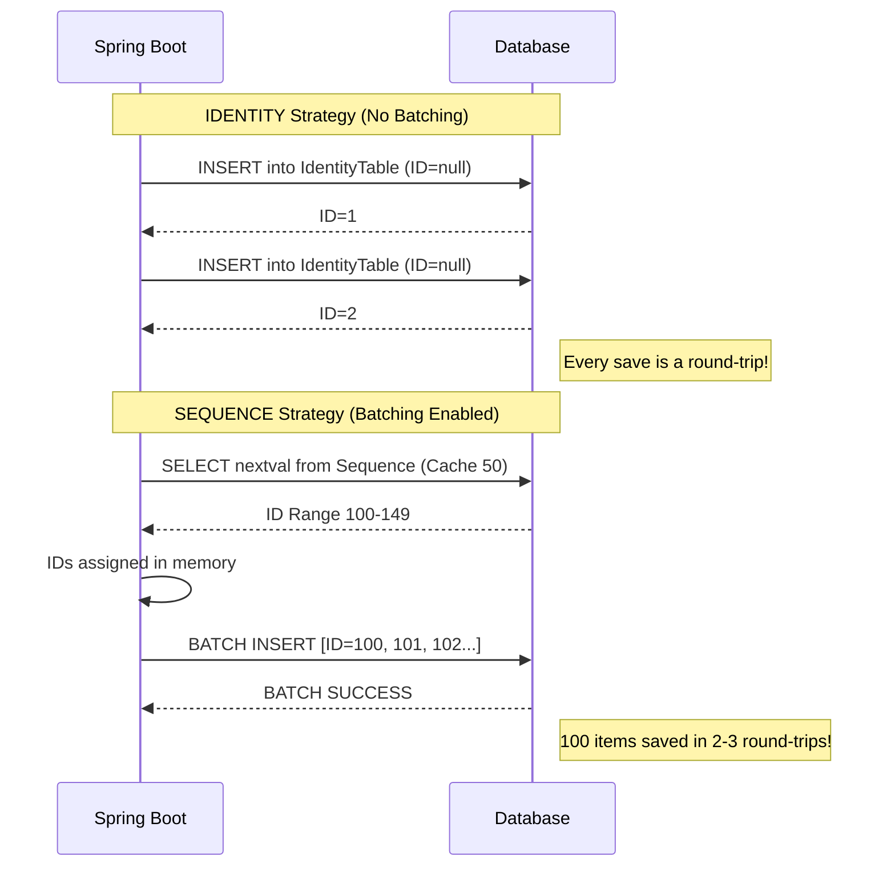

# Scenario 94: JPA GenerationTypes Deep Dive

## Overview
How you generate IDs for your entities has a massive impact on performance, especially during **bulk inserts**.

This scenario demonstrates the 4 primary strategies:
1.  **`IDENTITY`**: Database handles incrementing (e.g., `AUTO_INCREMENT`).
2.  **`SEQUENCE`**: Uses a database sequence object (Best for performance).
3.  **`TABLE`**: Uses a dedicated table to simulate sequences (Slowest).
4.  **`UUID`**: Application generates a 128-bit unique string (Best for distributed systems).
5.  **`AUTO`**: Hibernate picks the best strategy based on the DB Dialect.

---

## 🚀 The Strategies

### 1. GenerationType.IDENTITY (The "Bakery Token" 🥯)
*   **How it works**: Hibernate sends the `INSERT` without an ID, and the DB generates it.
*   **Analogy**: You only get your number *after* you reach the machine. You can't take 10 tokens home; you must wait in line for each one.
*   **Impact**: This **disables JDBC batching**. Hibernate must execute the `INSERT` **immediately** to get the ID back.

### 2. GenerationType.SEQUENCE (The "Movie Ticket Site" 🎟️)
*   **How it works**: Hibernate asks the DB for a range of IDs (e.g., 50 at a time).
*   **Analogy**: You "pre-book" 50 seats in one go. You don't have to wait for the movie to start (the INSERT) to know your seat.
*   **Impact**: Hibernate assigned IDs in memory, allowing it to **batch inserts** together.

### 3. GenerationType.UUID (The "Passport ID" 🆔)
*   **How it works**: The **Application** generates a globally unique 128-bit string.
*   **Analogy**: You are born with a unique fingerprint; you don't need to ask a central office for it every time you want to do something.
*   **Impact**: ZERO database round-trips for ID generation. Excellent for horizontal scaling and merging data from different databases.

### 4. GenerationType.TABLE (The "Logbook" 📖)
*   **How it works**: A separate table manages IDs.
*   **Analogy**: Everyone must wait for a single receptionist to write the next number in a physical book.
*   **Impact**: Extremely slow due to row-level locks on the generator table.

---

## 📊 Visualizing Batching Behavior



---

## 🧪 Testing the Scenario

### Case 1: Identity Performance
```bash
curl -X POST "http://localhost:8080/debug-application/api/scenario94/test/identity?count=100"
```
*Observe the `durationMs` and check application logs for individual INSERT statements.*

### Case 2: Sequence Performance (Batching)
```bash
curl -X POST "http://localhost:8080/debug-application/api/scenario94/test/sequence?count=100"
```
*This should generally be faster in a real DB (H2 is too fast to notice a huge gap, but the logs will show the difference).*

### Case 3: UUID Performance (Decentralized)
```bash
curl -X POST "http://localhost:8080/debug-application/api/scenario94/test/uuid?count=100"
```
*UUIDs are generated in the application. Great for scaling!*

### Case 4: AUTO Strategy
```bash
curl -X POST "http://localhost:8080/debug-application/api/scenario94/test/auto?count=100"
```
*Hibernate picks the best strategy for H2 (usually SEQUENCE).*

---

## Interview Tip 💡
**Q**: *"Why does `GenerationType.IDENTITY` disable batching in Hibernate?"*  
**A**: *"Hibernate's 'Unit of Work' pattern requires that every entity in the Persistence Context must have an ID. With IDENTITY, the ID is only known AFTER the DB insert. Therefore, Hibernate cannot delay the insert to batch it; it must execute it immediately to populate the entity's ID field."*

**Q**: *"What is the `allocationSize` in `@SequenceGenerator`?"*  
**A**: *"It defines how many IDs Hibernate should 'reserve' in a single call to the sequence. An `allocationSize` of 50 means Hibernate makes 1 call to the DB and can then perform 50 inserts in memory before calling the sequence again. This is key for high-performance batching."*
